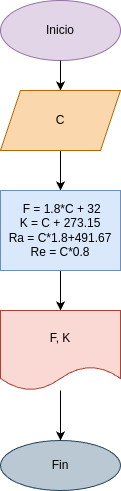

# Programa 4 : convertir_en_temperatura
Programa en python para convertir °C a °K y °F

## Análisis

### Variables de entrada
- °c = Grados Celcius

### Procesamiento
- °F = Grados Fahrenheit
- °K = Grados Kelvin

- °F = (°C x 9/5) + 32
- °K = °C + 273.15

## Diseño

## Construccion
- Codigo implementado en el archivo convertir_en_temperatura.py